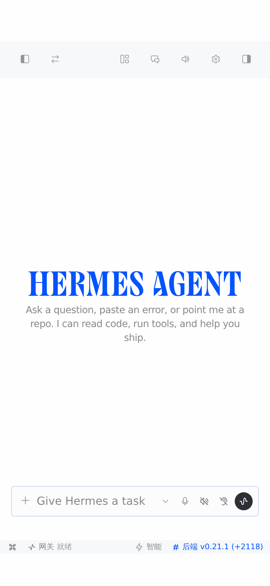
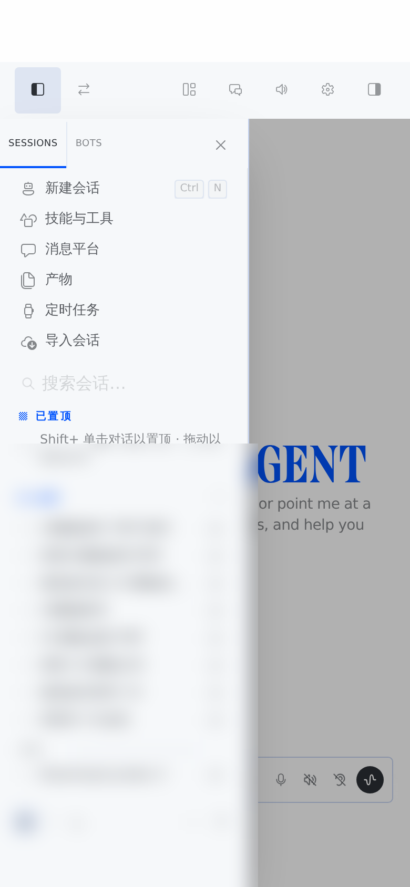

# Hermes Desktop — Web build (iOS-first)

> Documentation home for the web/mobile build of the Hermes desktop app.
> **Code lives on the fork branch:** `zswll2/hermes-agent` → `feat/desktop-web`
> (this repo holds the write-up plus an exportable patch series, so the fork's `main` can keep tracking upstream).

**语言 / Language:** [English](README.md) · [**中文**](README.zh-CN.md)

---


The Hermes **desktop app's own renderer**, served as a web app at `/app` on the dashboard's HTTP
server. Built for phones — primarily iOS (Safari + add-to-home-screen) — while staying a normal
desktop web app on large screens.

> **中文速览**：这是把 Hermes **桌面客户端**（Electron 的 React 渲染层）编译成 Web 版，挂在
> `hermes dashboard` 的 `/app` 路径下，**手机（尤其 iOS）优先**。意图是"出门在外用手机连家里的
> 网关干活"，所以**必须连网关在线**、**不需要离线能力**。本分支独立维护，不谋求并入上游（原因见下）。

- **Branch**: `feat/desktop-web` on this fork
- **Synced to upstream `main`**: `dfc28b61a0cf` (2026-09-15)
- **Touches**: `apps/desktop/**` + 2 files in `hermes_cli/` (hosting). Nothing else.
- **Upstream intent**: **not** proposed for merge (see *Why this lives in a fork*).

---

## Screenshots

| Chat (cold start, standalone) | Session drawer + scrim |
|---|---|
|  |  |

*Real iPhone viewport (390×844, `--safe-top:59px` / `--safe-bottom:34px` injected). The session list is blurred — those are real session names.*

## What you get

| | |
|---|---|
| Real desktop UI on the phone | The desktop app's own transcript, composer, panes, terminal, session sidebar — not a re-skin of the dashboard's embedded TUI |
| Installable | Home-screen install with `display: standalone` (no browser chrome), notch/status-bar aware |
| Touch-correct | 44px minimum touch targets, safe-area insets top **and** bottom, drawer + scrim + explicit close, long-press to reorder without stealing scroll |
| Update-safe | Hashed assets, `no-store` HTML, and a build-stamp self-check that offers/does a single reload when the server has a newer build |
| Credential-safe | **No service worker**, and any legacy SW/Cache Storage is purged at startup (the page carries a session token; caching it is a credential-leak risk) |

## Requirements

- Hermes with a working `hermes dashboard` (this build is served by the dashboard's server).
- An HTTPS origin you control (reverse proxy). **HTTPS is required** for add-to-home-screen and
  for stable WebSocket behaviour on iOS.
- iOS 16+ recommended. Works on Android/desktop browsers too.

## Build

```bash
cd apps/desktop
npm ci
npm run build:web          # → apps/desktop/dist-web/
```

## Deploy (behind the dashboard's auth gate)

The `/app` surface is **opt-in and off by default**: with no `HERMES_WEB_APP_DIST` set, the server
behaves exactly as before.

```bash
# 1) point the dashboard at the built web app
sudo mkdir -p /etc/systemd/system/hermes-dashboard.service.d
sudo tee /etc/systemd/system/hermes-dashboard.service.d/web-app.conf >/dev/null <<'EOF'
[Service]
Environment=HERMES_WEB_APP_DIST=/abs/path/to/hermes-agent/apps/desktop/dist-web
EOF

# 2) reload + restart
sudo systemctl daemon-reload && sudo systemctl restart hermes-dashboard
```

Then open `https://<your-host>/app` (unauthenticated requests are redirected to `/login`).

**Rollback (one line):**

```bash
sudo rm -f /etc/systemd/system/hermes-dashboard.service.d/web-app.conf && \
sudo systemctl daemon-reload && sudo systemctl restart hermes-dashboard
```

> Note: restarting the dashboard process also ends any chat session that process is hosting — do it
> when idle. After changing Hermes' *Python* code, the process must be restarted anyway; otherwise
> the model-picker endpoints answer `503 Restart required …` (stale-module guard).

## Add to home screen (iOS)

1. Open `/app` in Safari, sign in.
2. Share → **Add to Home Screen**.
3. Launch from the icon: it starts standalone, status bar transparent, content extending under the
   notch — because the build ships `viewport-fit=cover`, `apple-mobile-web-app-capable=yes`,
   `apple-mobile-web-app-status-bar-style=black-translucent`, `<link rel="manifest">` and an
   `apple-touch-icon`.
4. No service worker is registered, so **no offline mode** — by design (see *Why no service worker*).

## Mobile behaviour contract

| Behaviour | Rule |
|---|---|
| Safe area | `--safe-top` / `--safe-bottom` drive every fixed surface; the shell pads once, fixed chrome uses `top: calc(base + var(--safe-top))` |
| Touch targets | `(pointer: coarse)` ⇒ ≥44×44px buttons, 16px minimum font in inputs (prevents iOS focus zoom) |
| Drawers | Left = sessions; right = terminal/files/review. Both: full-height scrim (`z-30`, tap to close) + ≥44px close button + Escape |
| Reordering | Sessions reorder on **long-press (~400ms, 5px tolerance)** on touch; a quick swipe only scrolls. Mouse drag stays instant |
| Edge swipe | **Removed on purpose** — it fights iOS' back gesture; use the titlebar toggle |
| Bottom stack | `composer dock → statusbar → safe area`, never overlapping; the stack stays out of the home-indicator band |
| Zoom | No fake `user-scalable=no` (iOS ignores it). Instead `touch-action: manipulation` + 16px inputs |
| Terminal on cold start | Never auto-mounted on a narrow viewport — you get the chat, not a shell |
| Updates | Build stamp compared on load **and** on `visibilitychange`; one automatic reload per new stamp (loop-guarded), plus a manual prompt |

## Why no service worker

The `/app` HTML is served with a **short-lived session token injected into the page**. A service
worker that caches that HTML (or API responses) would persist credentials on disk and keep serving
pages bound to expired tokens. Offline is not a goal for this app — every action needs a live
gateway/WebSocket. So the build registers none, and additionally **unregisters any legacy service
worker and deletes all Cache Storage entries at startup**, so installations that ever ran a cached
build heal themselves.

## Why this lives in a fork

Upstream's `web/AGENTS.md` is explicit: *"Do not re-implement the primary chat experience in React
… If you are rebuilding the transcript or composer for the dashboard, stop and extend Ink."* This
build is exactly that second surface, so it stays out of tree. Two related upstream decisions point
the same way: [#70397](https://github.com/NousResearch/hermes-agent/issues/70397) was closed ("main
already ships a responsive drawer"), and the desktop-web PR
[#98079](https://github.com/NousResearch/hermes-agent/pull/98079) has sat uncommented since
2026-08-29.

**The PWA install surface is the one piece upstream explicitly welcomed** (same #70397 thread:
*"genuinely valuable and still absent from main … welcome as a standalone rebased PR"*). If you want
that landed upstream, it's ~22 lines — `web/public/manifest.webmanifest` + 6 meta lines in
`web/index.html` + 3 icons — and it needs **no** service worker under this build's reasoning.

## Where the code lives

| | |
|---|---|
| **Single source of truth** | fork branch `zswll2/hermes-agent` → `feat/desktop-web` (32 commits, base `ac0f4104c5`) |
| **This repo** | the write-up, plus `patches/` (32 exported patches) and `scripts/apply-patches.sh` |

One source of truth on purpose: the fork's `main` must stay a clean fast-forward of upstream, and a
second copy of the source here would drift immediately.

### Applying the patches

```bash
bash scripts/apply-patches.sh          # clones upstream, checks out the base, applies all patches
```

Manual equivalent:

```bash
git clone https://github.com/NousResearch/hermes-agent.git
cd hermes-agent
git checkout -b feat/desktop-web ac0f4104c55d9de19bbe8ac431d2df97836d1865
git am /path/to/patches/*.patch
cd apps/desktop && npm ci && npm run build:web
```

> ⚠️ The patch base is `ac0f4104c5`; upstream `main` has moved 1,700+ commits since. Amending these
> patches straight onto a fresh `main` **will conflict** (purely additive files usually apply; edits
> to existing files do not). That is why cloning the branch is the recommended route.

## Known limitations

- **Offline: none.** No service worker, no cache — if the gateway is unreachable, the app is too.
- **iOS quirks not fully verified in automation**: real `env(safe-area-inset-*)` values, keyboard
  occlusion, resume-after-background, iCloud filenames with combining characters.
- **Electron is untouched**: this build never changes the desktop app's packaged behaviour; the web
  mode is a separate `vite --mode web` output plus a browser capability shim.
- Headless verification can't see real notches: automated checks inject `--safe-top/--safe-bottom`
  and assert geometry, which is why real-device testing still matters.

## Keeping it alive

`main` on this fork tracks upstream `main` (fast-forward via GitHub *merge-upstream*). The feature
branch is an out-of-tree addition, so after a big upstream sync, re-verify these seams:

```
apps/desktop/src/lib/bridge/web-*.ts        # browser capability shim + file registry
apps/desktop/src/api/client.ts              # single REST seam
apps/desktop/src/styles.css                 # safe-area + coarse-pointer rules
apps/desktop/src/components/pane-shell/**   # drawers, scrim, tab strips
apps/desktop/src/app/chat/sidebar/**        # reorder sensors
hermes_cli/web_server*.py                   # /app hosting behind the auth gate
```

Build check: `cd apps/desktop && npm run typecheck && npx vitest run src/lib/bridge src/lib src/store`.

## License

Upstream Hermes Agent is MIT; this branch adds no new license terms.
